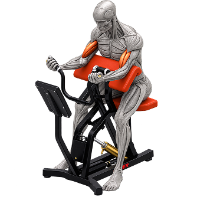

# 🏋️ FitLog — Workout Library

**A dark, no-nonsense gym companion: pick a lift, lock it into today's plan, and watch the week's work add up.**



---

## 📖 Description

**FitLog** is a modern workout library and daily planner built with **Next.js 16**, **TypeScript**, and **Tailwind CSS**. It lets you browse a curated collection of 12 strength and conditioning exercises, view detailed instructions and specs, add lifts to your daily plan (capped at 5), save workouts for later, and track your daily training volume with live metrics.

Designed with a bold dark theme and accent lime green (`#ccff00`), inspired by modern fitness UI — clean, focused, and fast.

---

## 🛠️ Technologies Used

| Technology | Purpose |
|------------|---------|
| **Next.js 16** (App Router) | React framework with file-based routing |
| **TypeScript** | Type-safe development |
| **Tailwind CSS 4** | Utility-first styling and responsive design |
| **React Context API** | Global state management for plan and saved workouts |
| **localStorage** | Persist user data across browser sessions |
| **Google Fonts (Oswald + Inter)** | Bold display font + clean sans-serif body |
| **Custom SVG Icons** | Lightweight inline icons for a consistent look |

---

## ✨ Key Features

1. **📚 Workout Library** — Browse 12 exercises in a responsive 3-column grid with category tags, equipment info, and stat icons (duration, calories, rating).

2. **📋 Detailed Workout Pages** — Each workout has a dedicated dynamic route (`/workouts/[id]`) with a large image, full description, category pills, key specs table, and step-by-step instructions.

3. **➕ Add to Plan / Save for Later** — Add workouts to today's plan (capped at 5 lifts) or save them for later. Navbar badges update in real time.

4. **📊 My Plan Dashboard** — View your daily plan with live metrics (total exercises, minutes, calories), switch between Today's Plan and Saved tabs, and sort by duration, calories, or rating.

5. **💾 Persistent State with localStorage** — Plan and saved workouts survive page reloads and browser sessions.

6. **🔔 Toast Notifications** — Non-intrusive feedback when you add, save, remove, or mark a workout as done.

7. **🌐 Custom 404 Page** — A styled 404 page for invalid routes.

8. **📱 Fully Responsive** — Works smoothly on mobile, tablet, and desktop.

---

## 🚀 Getting Started

### Prerequisites

- Node.js 18 or higher
- npm (or yarn / pnpm / bun)

### Installation

```bash
# 1. Clone the repository
git clone https://github.com/Alok-242-115-328/A6_fitlog.git

# 2. Navigate into the project folder
cd A6_fitlog

# 3. Install dependencies
npm install

# 4. Start the development server
npm run dev
```

## 📬 Submission Links

- 🌐 **Live Demo:** [https://strong-baklava-7f5a6d.netlify.app](https://strong-baklava-7f5a6d.netlify.app)

### Build for Production

```bash
npm run build
npm start
```

---

## 📁 Project Structure

```
fitlog/
├── app/
│   ├── my-plan/
│   │   └── page.tsx            # My Plan dashboard
│   ├── workouts/
│   │   └── [id]/
│   │       └── page.tsx        # Workout detail (dynamic route)
│   ├── globals.css             # Global styles
│   ├── layout.tsx              # Root layout with Navbar + Footer
│   ├── not-found.tsx           # Custom 404 page
│   └── page.tsx                # Home page (Banner + Library)
├── components/
│   ├── AddToPlanButtons.tsx    # Add / Save buttons with toast
│   ├── Banner.tsx              # Hero section
│   ├── Footer.tsx
│   ├── Library.tsx             # Workout grid with loading skeleton
│   ├── Navbar.tsx              # Top nav with live plan/saved badges
│   └── WorkoutCard.tsx         # Individual workout card
├── context/
│   └── PlanContext.tsx         # Global plan state + localStorage
├── public/
│   ├── data/
│   │   └── workouts.json       # Workout dataset (12 exercises)
│   ├── banner.png
│   └── logo.png
└── ...
```

---

## 🎨 Design Highlights

- **Dark theme** — `#0a0a0a` background with `#111111` cards
- **Accent color** — `#ccff00` (vibrant lime) for buttons, badges, and icons
- **Typography** — Oswald for bold uppercase headings, Inter for body text
- **Consistent cards** — Rounded corners, subtle borders, hover lift effects

---

## 👨‍💻 Author

**Alok Talukder**

- 📂 **GitHub Repository:** [https://github.com/Alok-242-115-328/A6_fitlog](https://github.com/Alok-242-115-328/A6_fitlog)

---

## 📄 License

This project is open source and available for personal and educational use.

---

## 🙏 Acknowledgements

Built as part of a full-stack web development assignment to practice **Next.js App Router**, **Context API**, **localStorage**, and **modern Tailwind CSS design**.
